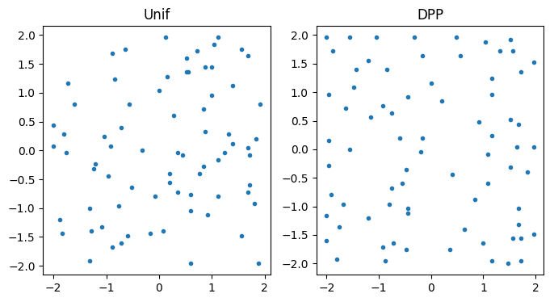
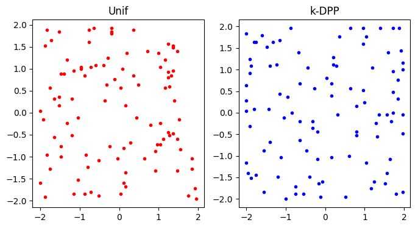
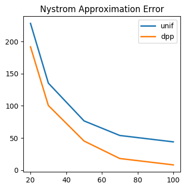
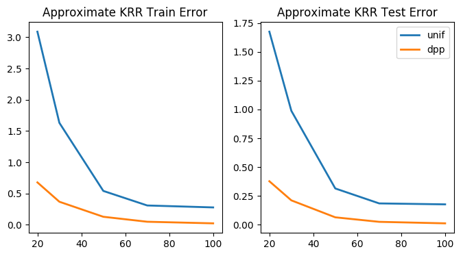
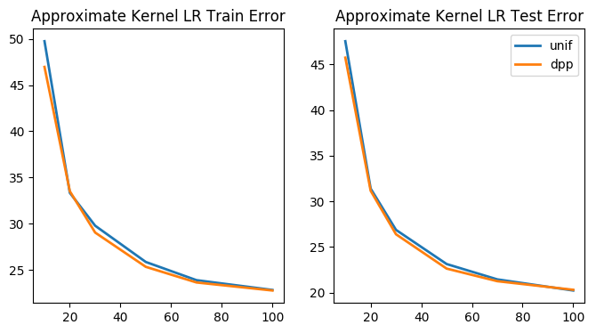

# Determinantal Point Process

This repository includes sampling methods for *determinantal point processes* (*DPP*s). It is still under development.

## Prerequisites
* `Python 2.7`
* `numpy`
* `scipy`
* `matplotlib`
* `Matlab`

## Currently Available Methods

* Exact (k)DPP sampling (with eigen-decomposition)

## Under Construction

* Markov Chain Monte Carlo Sampling for (k)DPP (with Gaussian-Auadrature Acceleration)

---

## Toy Demo ('demo.py')

## Demo on Nystrom Method

## Demo on Approximate Kernel Ridge Regression 

## Demo on Approximate Kernel Logistic Regression

