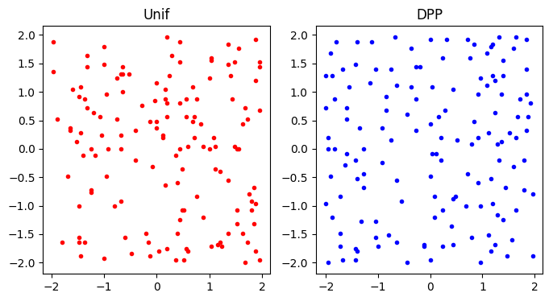

# Determinantal Point Process

This repository includes sampling methods for *determinantal point processes* (*DPP*s). It is still under development.

## Prerequisites
* `Python 2.7`
* `PyTorch >= 0.2`
* `numpy`
* `scipy`
* `matplotlib`

---

## Current Available Methods

#### Exact DPP sampling (with eigen-decomposition)
#### Markov Chain Monte Carlo Sampling for DPP (with Gaussian-Auadrature Acceleration)

#### Exact k-DPP sampling (with eigen-decomposition)
#### Markov Chain Monte Carlo Sampling for k-DPP (with Gaussian-Auadrature Acceleration)

